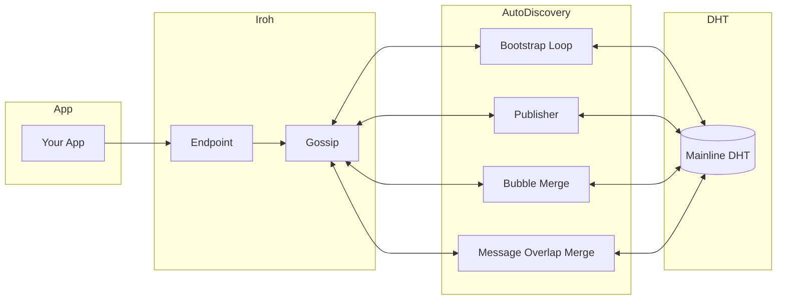
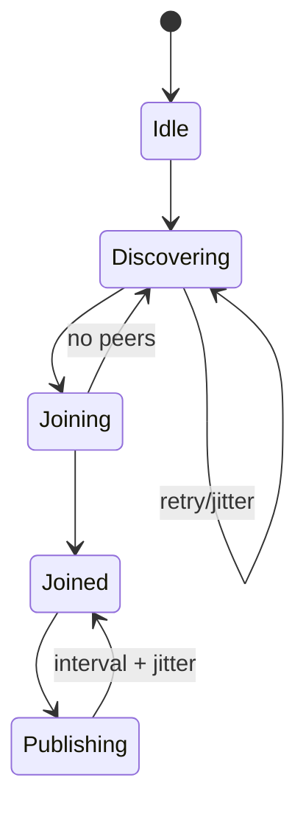
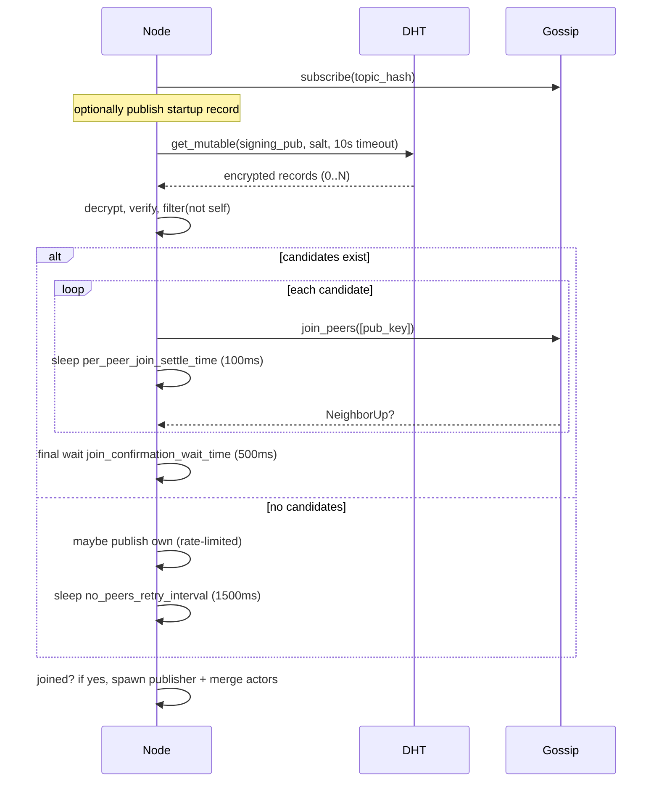
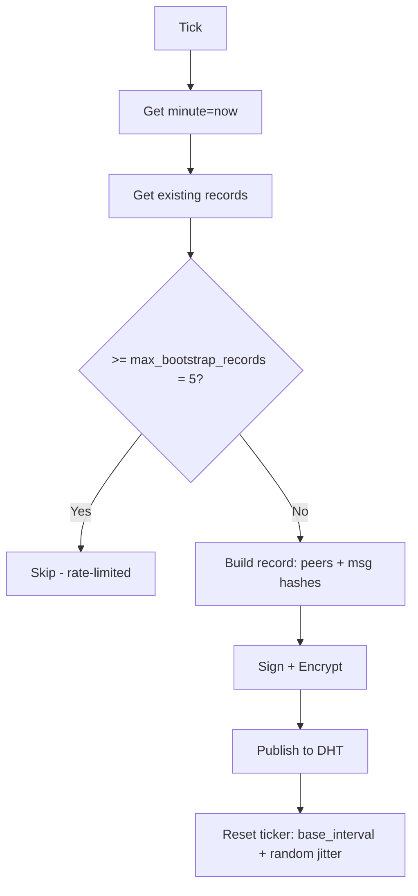
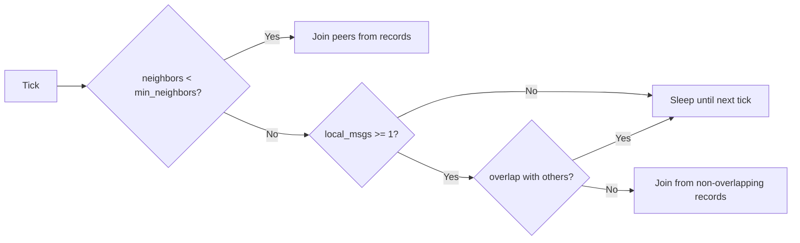
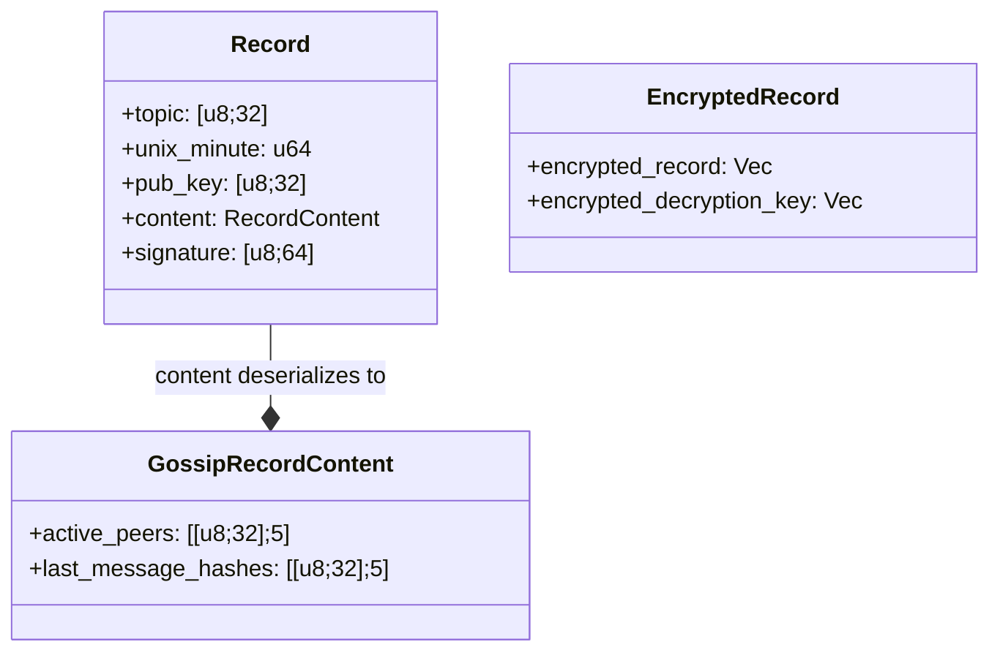
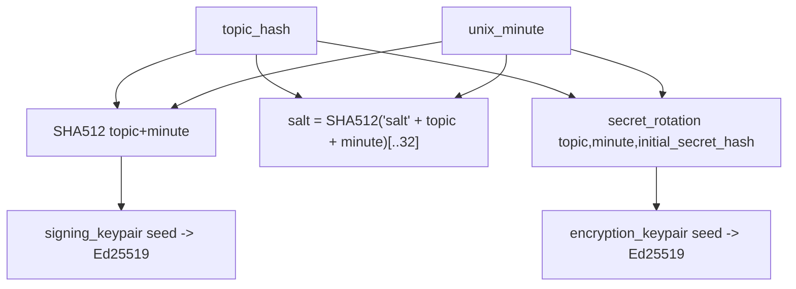

# Architecture

This document explains how the library operates. It complements the spec
(PROTOCOL.md) with high-level structure, data flows, and failure handling.

Contents:
- System overview
- Bootstrapping
- Publishing
- Bubble detection and merging
- Data model
- Failure modes
- Tuning

## System overview

Components:
- iroh endpoint and gossip
- Auto-discovery (bootstrap loop)
- Publisher (background actor)
- Bubble merge (background actor)
- Message overlap merge (background actor)
- DHT client (mutable records)
- Crypto (signing, encryption, secret rotation)



Node lifecycle:
- Start iroh endpoint
- Start gossip
- Auto-discovery:
  - Join topic, attempt bootstrap, connect
  - Spawn publisher, bubble merge, and message overlap merge actors on success

State machine:



## Bootstrapping

Goal: connect to at least one topic peer.

Sequence:



Key points:
- First iteration: optionally also check previous unix minute (`check_last_minute_record_first_on_startup`).
- Both `unix_minute` and `unix_minute - 1` records are always fetched.
- Pacing avoids bursts and "bubbles."
- Keep trying until joined.

Pseudocode:

```text
loop:
  if joined(): return sender, receiver

  minute = first_attempt && check_last_minute_first ? -1 : 0
  recs = get_records(unix_minute(minute) - 1) + get_records(unix_minute(minute))

  if recs.is_empty():
    maybe_publish_this_minute()
    sleep(no_peers_retry_interval = 1500ms)
    continue

  for peer in extract_bootstrap_nodes(recs):
    if joined(): break
    join_peer(peer)
    sleep(per_peer_join_settle_time = 100ms)

  sleep(join_confirmation_wait_time = 500ms)
  if joined(): return
  maybe_publish_this_minute()
  sleep(discovery_poll_interval = 2000ms)
```

## Publishing

Goal: publish active participation without overloading DHT.

Flow:



Pseudocode:

```text
// Publisher actor loop (interval: base_interval + random jitter)
on tick:
  records = get_records(unix_minute(0))
  if records.len >= max_bootstrap_records(5): return

  rec = make_record(neighbors(<=5), last_hashes(<=5))
  enc = encrypt(sign(rec))
  publish(enc)
  reset_ticker(base_interval + random(0, max_jitter))
```

## Bubble detection and merging

Signal 1: small cluster \(neighbors < min\_neighbors, default 4\).
- Extract peer ids from discovered records.
- Exclude zeros, self, current neighbors.
- Join up to max_join_peer_count (default 4).

Signal 2: non-overlapping message sets.
- Compare local last_message_hashes with others.
- If disjoint, collect publisher + peers from those records.
- Attempt joins to bridge partitions.

Decision graph:



## Data model

Record (summary):
- topic hash (32)
- unix_minute (u64)
- pub_key (publisher ed25519 public key)
- content (serialized RecordContent: active_peers + last_message_hashes)
- signature (64)

EncryptedRecord:
- encrypted_record (Vec)
- encrypted_decryption_key (Vec)

Diagram:



Key derivation:



## Failure modes

- DHT get timeout:
  - Return empty set; continue loop.
- Decrypt/verify failure:
  - Drop record; proceed.
- Publish failure:
  - DHT layer retries with jittered intervals (3 retries, 5s base + 0-10s jitter).
- Join failure:
  - Continue to next peer; final 500ms wait; loop.

## Tuning

- Per-minute cap \(records \ge max\_bootstrap\_records, default 5\) gates publishing.
- Per-peer pacing (100ms) reduces bursts.
- No-peers retry (1500ms) and discovery poll (2000ms) stabilize DHT load.
- Message window size (5 peers, 5 hashes) is a trade-off:
  - Larger window = better visibility, larger records.
  - Smaller window = lower bandwidth, less overlap detection.

Parameters (all configurable):
- `max_bootstrap_records` (default 5)
- `max_join_peer_count` (default 4)
- `min_neighbors` for bubble merge (default 4)
- DHT timeouts, retry count, and jitter
- Bootstrap timing: no_peers_retry, per_peer_settle, join_confirmation, discovery_poll
- Publisher timing: initial_delay, base_interval, max_jitter
- Merge timing: base_interval, max_jitter (separate for bubble and overlap)
