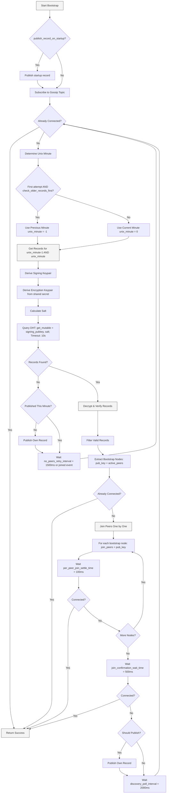
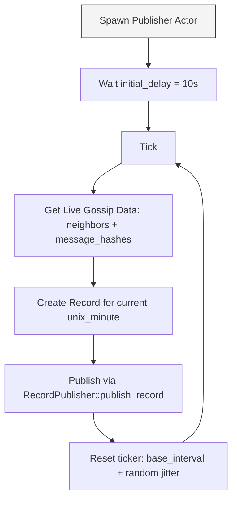
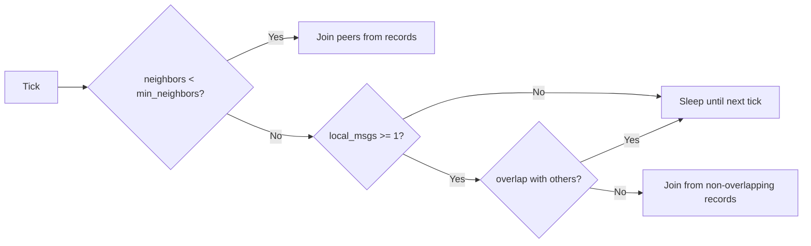
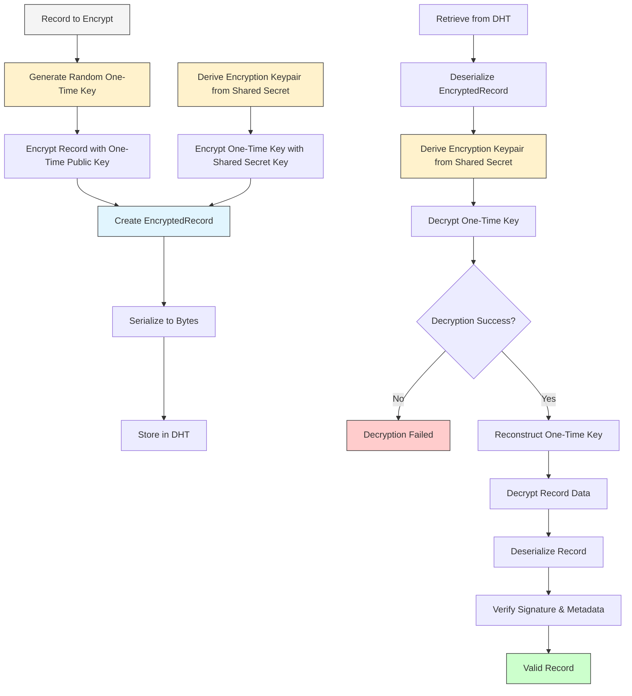

# How this works: Protocol (spec)

## Publishing procedure

The publishing procedure is a rate-limited mechanism that prevents DHT overload while ensuring active participation in the gossip network. Implemented in `RecordPublisher::publish_record()`:

- `max_bootstrap_records`: 5 (default, configurable via `BootstrapConfig`)
- DHT get timeout: 10s (default, configurable via `DhtConfig`)
- DHT put retries: 3 (default, configurable via `DhtConfig`)
- DHT retry interval: 5s base + random 0-10s jitter (default, configurable via `DhtConfig`)

### Publishing Procedure

1. **Record Discovery**
   - Call `get_records()` to fetch, decrypt, and verify existing records for the current unix minute
   - Use the same key derivation as bootstrap:
     - Derive signing keypair: `keypair_seed = SHA512(topic_hash + unix_minute)[..32]`
     - Derive encryption keypair: `enc_keypair_seed = secret_rotation_function.get_unix_minute_secret(topic_hash, unix_minute, initial_secret_hash)`
     - Calculate salt: `salt = SHA512("salt" + topic_hash + unix_minute)[..32]`
     - Query DHT: `get_mutable(signing_pubkey, salt)` with 10s timeout

2. **Rate Limiting Check**
   - If `records.len() >= max_bootstrap_records` (default 5):
     - **Do not publish** - return silently to prevent DHT overload
     - This implements the core rate limiting mechanism

3. **Record Creation** (if under limit)
   - Prepare `active_peers[5]` array:
     - Fill with up to 5 (`MAX_RECORD_PEERS`) current iroh-gossip neighbors
     - Remaining slots filled with zeros `[0; 32]`
   - Prepare `last_message_hashes[5]` array:
     - Fill with up to 5 (`MAX_MESSAGE_HASHES`) recent message hashes for proof of relay
     - Remaining slots filled with zeros `[0; 32]`

4. **Record Signing and Publishing**
   - Create signed record using `Record::sign()`:
     - Include: `topic_hash`, `unix_minute`, `pub_key`, content (serialized `active_peers` + `last_message_hashes`)
     - Sign with node's ed25519 signing key
   - Encrypt record using one-time encryption key
   - Publish to DHT via `Dht::put_mutable()` with retry support

5. **Error Handling**
   - DHT timeouts return error after retries are exhausted
   - Failed record decryption/verification are ignored
   - DHT put retries with jittered intervals prevent synchronized access patterns

### Publishing Flow Diagram

```mermaid
flowchart TD
  A[Start Publishing Procedure] --> B[Get Current Unix Minute]
  B --> C[Derive Keys: Signing & Encryption]
  C --> D[Calculate Salt: SHA512 = "salt" + topic_hash + unix_minute]
  D --> E[Query DHT: get_mutable = signing_pubkey, salt; Timeout: 10s]

  E --> F[Decrypt & Verify Records]
  F --> G{records.len >= max_bootstrap_records = default 5?}

  G -- Yes --> I[Return silently - Rate Limited]
  G -- No --> J[Prepare Active Peers Array]

  J --> K[Fill active_peers with up to 5 gossip neighbors]
  K --> L[Prepare Last Message Hashes Array]
  L --> M[Fill last_message_hashes with up to 5 recent hashes]

  M --> N[Create Signed Record]
  N --> O[Sign with: topic + unix_minute + pub_key + content]
  O --> P[Encrypt Record with One-Time Key]
  P --> Q[Publish to DHT with retries]

  Q --> R{Publish Success?}
  R -- Yes --> S[Done]
  R -- No --> T[Retry with jittered interval]
  T --> U{Retries Left?}
  U -- Yes --> Q
  U -- No --> V[Return Error]

  style A fill:#f4f4f4,stroke:#333,stroke-width:1px
  style I fill:#ffcccc,stroke:#333,stroke-width:1px
  style S fill:#ccffcc,stroke:#333,stroke-width:1px
  style V fill:#ffcccc,stroke:#333,stroke-width:1px
  style N fill:#f4f4f4,stroke:#333,stroke-width:1px
```

## Bootstrap procedure

The bootstrap procedure is a continuous loop that attempts to discover and connect to existing nodes in the gossip network. Implemented in `BootstrapActor::start_bootstrap()`:

- `max_join_peer_count`: 4 (default, configurable via `Config`)
- `max_bootstrap_records`: 5 (default, configurable via `BootstrapConfig`)
- DHT get timeout: 10s (default, configurable via `DhtConfig`)
- No peers retry interval: 1500ms (default, configurable via `BootstrapConfig`)
- Per-peer join settle time: 100ms (default, configurable via `BootstrapConfig`)
- Final join confirmation wait: 500ms (default, configurable via `BootstrapConfig`)
- Discovery poll interval: 2000ms (default, configurable via `BootstrapConfig`)
- Publish on startup: true (default, configurable via `BootstrapConfig`)
- Check older records first on startup (`check_older_records_first_on_startup`): false (default, configurable via `BootstrapConfig`)

### Bootstrap Loop

1. **Initial Setup**
   - Subscribe to the gossip topic using `topic_id.hash`
   - Optionally publish own record before the first DHT get (`publish_record_on_startup`)
   - Enter the main bootstrap loop

2. **Connection Check**
   - Check if already connected to at least one gossip peer via `gossip_receiver.is_joined()`
   - If connected, exit bootstrap loop

3. **Time Window Selection**
   - If `check_older_records_first_on_startup` is enabled and this is the first attempt: check previous `unix minute-1` and `unix_minute-2`
   - Otherwise: check current unix minute `unix_minute` and `unix_minute-1`
   - Two records are always fetched

4. **Record Discovery**
   - Call `get_records()` for both `unix_minute - 1` and `unix_minute`:
     - Derive signing keypair: `keypair_seed = SHA512(topic_hash + unix_minute)[..32]`
     - Derive encryption keypair from shared secret
     - Calculate salt: `SHA512("salt" + topic_hash + unix_minute)[..32]`
     - Query DHT: `get_mutable(signing_pubkey, salt)` with 10s timeout
     - Decrypt each record using the encryption keypair
     - Verify signature, unix_minute, and topic hash
     - Filter out own records (matching pub_key)

5. **If no valid Records Found**
   - If no valid records found and haven't published in this unix minute, publish own record
   - Wait for `no_peers_retry_interval` (default 1500ms) or a `joined()` event, then continue loop

6. **If valid Records Found**
   - Extract bootstrap nodes from records:
     - Include `record.pub_key` (the publisher)
     - Include all non-zero entries from `record.active_peers[5]`
   - Convert byte arrays to valid `iroh::EndpointId` instances

7. **Connection Attempts**
   - Check again if already connected (someone might have connected to us)
   - If not connected, attempt to join peers one by one:
     - Call `gossip_sender.join_peers(vec![pub_key])` for each bootstrap node
     - Wait `per_peer_join_settle_time` (default 100ms) between attempts
     - Break early if connection established

8. **Final Connection Verification**
   - If still not connected, wait `join_confirmation_wait_time` (default 500ms)
   - Check `gossip_receiver.is_joined()` one final time
   - If connected: exit loop successfully
   - If not connected: publish own record if not done this minute
   - Wait `discovery_poll_interval` (default 2000ms) and continue loop

### Error Handling
- DHT timeouts return error after retries are exhausted
- Failed record decryption/verification are treated as invalid records and ignored
- Failed peer connections don't interrupt the process
- Publishing failures don't prevent continued bootstrapping

### Bootstrap Flow Diagram



## Publisher

The Publisher is a separate background actor that runs after successful bootstrap to maintain topic presence on the DHT. Implemented in `PublisherActor`:

- Interval: `base_interval + random(0, max_jitter)` (default 10s base + 0-50s jitter)
- Initial delay: 10s (default, configurable via `PublisherConfig`)
- No exponential backoff; interval is constant with jitter

### Publisher Loop

1. **Initialization**
   - Spawned as a background actor after successful bootstrap
   - Configures a ticker with `initial_delay` then repeating at `base_interval`

2. **Publishing Cycle**
   - On each tick: call `publish()` which creates a new record with current gossip state
   - After publishing, reset ticker to `base_interval + random(0, max_jitter)`
   - Record includes current neighbors (up to 5) and recent message hashes (up to 5)

### Publisher Flow Diagram



## Bubble detection and merging

Bubble detection and merging run as separate background actors alongside the publisher, each on their own interval timer.

### Bubble Merge (small cluster detection)

Implemented in `BubbleMergeActor`. Interval: 60s base + 0-120s jitter (default).

- If `neighbors.len() < min_neighbors` (default 4) AND DHT records exist:
  - Extract node IDs from `record.active_peers` in discovered records
  - Filter out: zero entries, current neighbors, own node ID
  - Attempt to join up to `max_join_peer_count` (default 4) new peers

### Message Overlap Merge (partition detection)

Implemented in `MessageOverlapMergeActor`. Interval: 60s base + 0-120s jitter (default).

- If local node has received messages (`last_message_hashes.len() >= 1`):
  - Compare local message hashes with `record.last_message_hashes` from other nodes
  - Identify records with non-overlapping message sets (potential network partition)
  - Extract all node IDs (publisher + active_peers) from non-overlapping records
  - Attempt to join these peers to bridge partitions

### Bubble Detection Decision Graph



## Record structure

The record struct wraps a serialized `RecordContent`:

```rust
#[derive(Debug, Clone, PartialEq, Eq, Hash)]
pub struct Record {
    // Header
    topic: [u8; 32],                    // SHA512(topic_string)[..32]
    unix_minute: u64,                   // floor(unixtime / 60)
    pub_key: [u8; 32],                  // publisher ed25519 public key

    // Content (serialized via postcard)
    content: RecordContent,             // Vec<u8> wrapping serialized data

    // Signature
    signature: [u8; 64],               // ed25519 signature over topic + unix_minute + pub_key + content
}

// Default content used by the gossip module:
pub struct GossipRecordContent {
    pub active_peers: [[u8; 32]; 5],        // MAX_RECORD_PEERS node ids
    pub last_message_hashes: [[u8; 32]; 5], // MAX_MESSAGE_HASHES recent hashes
}

// Variable size
#[derive(Debug, Clone)]
pub struct EncryptedRecord {
    encrypted_record: Vec<u8>,          // encrypted Record using one-time key
    encrypted_decryption_key: Vec<u8>,  // one-time decryption key encrypted with
                                        // shared secret derived encryption key
}
```

## Verification

The `Record::verify()` method performs the following checks:

1. **Topic Verification**: Verify `record.topic` matches the expected topic hash
2. **Time Verification**: Verify `record.unix_minute` matches the unix minute used for key derivation
3. **Signature Verification**:
   - Extract signature data: all record bytes except the last 64 bytes (signature)
   - Signature data includes: `topic + unix_minute + pub_key + content`
   - Verify ed25519 signature using `record.pub_key` as the public key
   - Use `verify_strict()` for enhanced security

### Additional Filtering
- **Decryption validation**: Records that fail decryption with the shared secret are rejected
- **Encoding validation**: Records that fail to decode from bytes are rejected

## Encryption, Decryption

A one-time key encryption scheme is used to protect record content while allowing authorized nodes to decrypt using a shared secret. The system uses a hybrid approach combining Ed25519 key derivation with HPKE encryption.

### Key Derivation

**Signing Keypair (Public DHT Discovery):**
- Purpose: Used for DHT mutable record signing and salt calculation
- Derivation: `signing_keypair_seed = SHA512(topic_hash + unix_minute)[..32]`
- Key: `ed25519_dalek::SigningKey::from_bytes(signing_keypair_seed)`
- Public: This keypair is deterministic and publicly derivable

**Encryption Keypair (Shared Secret Based):**
- Purpose: Used to encrypt/decrypt the one-time keys
- Derivation: `encryption_keypair_seed = secret_rotation_function.get_unix_minute_secret(topic_hash, unix_minute, initial_secret_hash)`
- Key: `ed25519_dalek::SigningKey::from_bytes(encryption_keypair_seed)`
- Private: Only nodes with the shared secret can derive this keypair

**Salt Calculation:**
- Purpose: Used as salt parameter for DHT mutable record storage
- Derivation: `salt = SHA512("salt" + topic_hash + unix_minute)[..32]`

### Encryption Process

1. **Generate One-Time Key**
   - Create random Ed25519 signing key: `one_time_key = ed25519_dalek::SigningKey::generate(rng)`
   - Extract public key: `one_time_public_key = one_time_key.verifying_key()`

2. **Encrypt Record Data**
   - Serialize record to bytes: `record_bytes = record.to_bytes()`
   - Encrypt with one-time public key: `encrypted_record = one_time_public_key.encrypt(record_bytes)`

3. **Encrypt One-Time Key**
   - Get one-time key bytes: `one_time_key_bytes = one_time_key.to_bytes()`
   - Derive encryption keypair from shared secret (see Key Derivation above)
   - Encrypt one-time private key: `encrypted_decryption_key = encryption_keypair.verifying_key().encrypt(one_time_key_bytes)`

4. **Create Encrypted Record**
   ```rust
   EncryptedRecord {
       encrypted_record: encrypted_record,
       encrypted_decryption_key: encrypted_decryption_key,
   }
   ```

### Decryption Process

1. **Decrypt One-Time Key**
   - Derive encryption keypair from shared secret (same as encryption)
   - Attempt decryption: `one_time_key_bytes = encryption_keypair.decrypt(encrypted_decryption_key)`
   - Reconstruct one-time key: `one_time_key = ed25519_dalek::SigningKey::from_bytes(one_time_key_bytes)`

2. **Decrypt Record Data**
   - Decrypt record: `decrypted_record_bytes = one_time_key.decrypt(encrypted_record)`
   - Deserialize: `record = Record::from_bytes(decrypted_record_bytes)`

3. **Verify Record**
   - Verify topic hash, unix_minute, and ed25519 signature (see Verification section)

### Encoding Format

**EncryptedRecord Serialization:**
```
[4 bytes: encrypted_record_length (little-endian u32)]
[variable: encrypted_record data]
[88 bytes: encrypted_decryption_key]
```

### Security Properties

- **Forward Secrecy**: One-time keys are generated randomly for each record
- **Access Control**: Only nodes with the shared secret can decrypt records
- **Key Rotation**: Supports secret rotation via the `SecretRotation` trait
- **Replay Protection**: Unix minute coupling prevents replay attacks
- **Public Discovery**: DHT discovery remains public while content stays private

### Encryption/Decryption Flow Diagram

